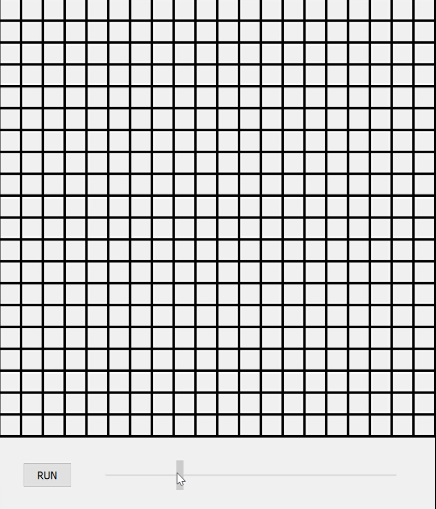
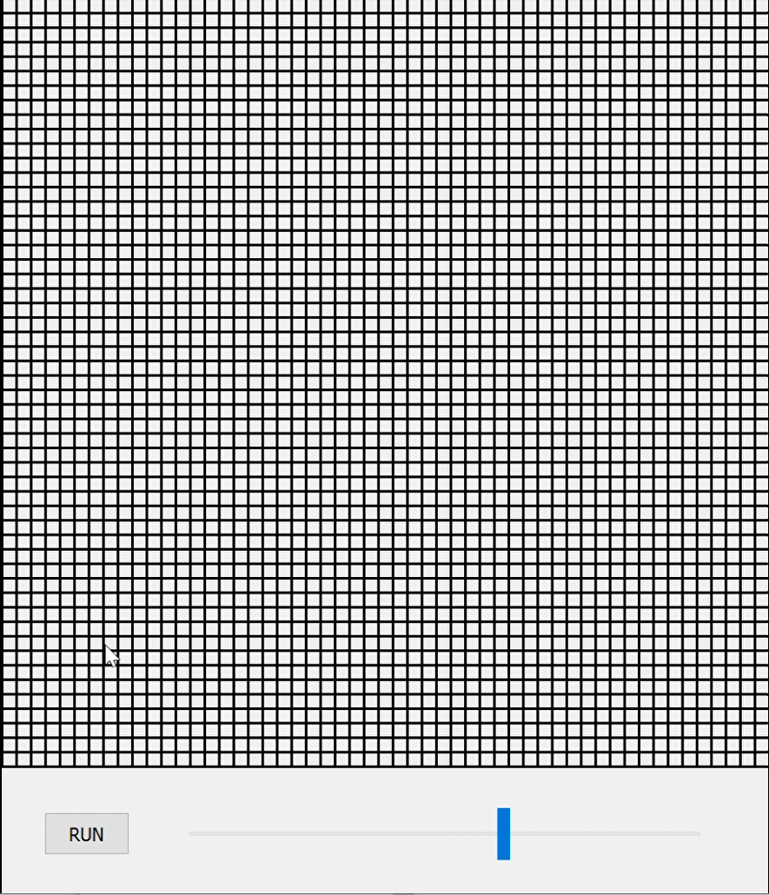
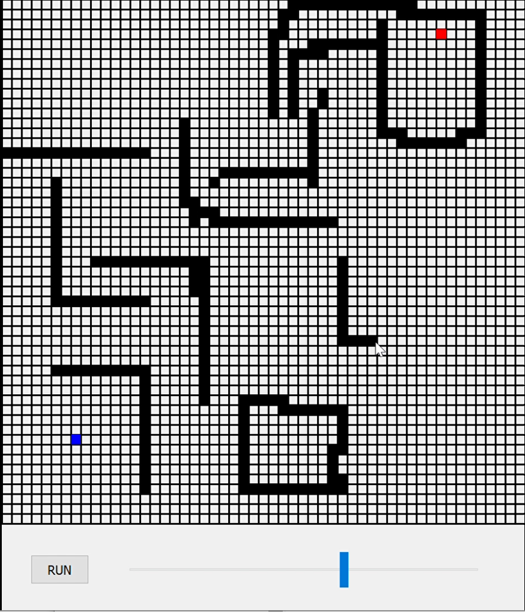
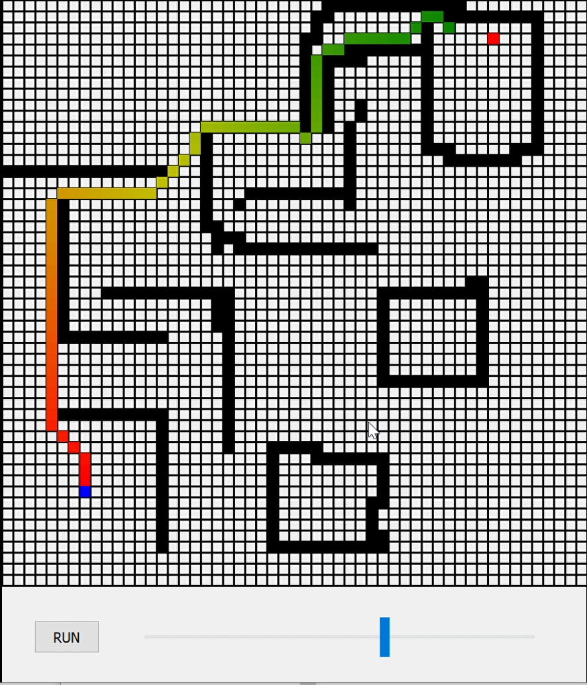

# maze-search
# About
Utility to create maze of given size (from 2x2 up to 1000x1000) with **black** obstacles, **start** and **end** square.  
Then using optimized A-star algorithm we perform shortest path finder and display it sequentially.  
GUI was created using pyQT library offering multiple convinient solutions.  
# Screens

  
  
# Author
_Paweł Fijałkowski_  
_Data Science_  
_Warsaw University of Technology_
